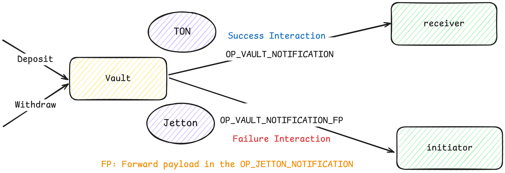

# TEP-4626: Tokenized Vaults Standard for TON Blockchain

**Status**: Draft  
**Type**: Application  
**Author**: [@throwunless]  
**Created**: 2025-08-04  
**Requires**: TEP-74, TEP-64  

## Summary

This proposal defines a standardized API for tokenized vaults on the TON blockchain, built upon the [TEP-74 Jetton standard](https://github.com/ton-blockchain/TEPs/blob/master/text/0074-jettons-standard.md) and inspired by the design principles of ERC-4626. It is adapted to TON’s **message-driven async design** and Jetton framework.  

The standard supports **deposit, withdrawal, and conversion rate queries**. It also introduces a standardized **cross-protocol communication interface** with unified notification mechanisms for operation results and callbacks.  

By unifying these core operations, the standard enhances **composability and interoperability** in TON’s DeFi ecosystem. It reduces duplicated implementations, minimizes fragmentation across protocols, and enables developers to build consistent and efficient vault logic.  

Readers are encouraged to review the [ERC-4626 standard](https://eips.ethereum.org/EIPS/eip-4626) for additional background and context.

## Motivation

The lack of standardization for tokenized vaults in the TON ecosystem leads to fragmented implementations, complicating protocol integration. This fragmentation arises from TON's unique asynchronous, message-driven architecture, which, while powerful, amplifies inconsistencies across vaults. Key issues include:

- **Inconsistent Callbacks**: Success/failure payload formats vary across implementations, hindering subsequent operations or rollbacks in interacting protocols—especially in TON's asynchronous message-passing environment—increasing error risks.
- **Non-Uniform Query Interfaces**: Get methods use inconsistent names and structures, forcing frontends and wallets to implement custom logic for each protocol. For example, some expose only the Jetton balance, while others require applying a conversion rate to show real asset value—often doubling integration time.
- **Divergent Event Formats**: Emitted events use varied formats, making it difficult for off-chain systems to monitor and parse events uniformly.
- **Inconsistent Price Queries**: Vault price query interfaces lack uniformity, causing yield aggregators to face challenges in fetching prices, increasing development costs and affecting yield accuracy.
- **Lack of Gas Estimation Standards**: No unified method to query gas consumption, making it difficult for developers to estimate interaction costs—particularly with TON's dynamic gas mechanics—leading to inefficiencies.
- **Varied Deposit/Withdrawal Processes**: Deposit and withdrawal flows and parameters differ, including how they handle Jetton transfers and TON's gas mechanics, increasing development complexity and resource waste.
- **Yield Calculation Inconsistencies**: Variations in how vaults calculate and distribute yields lead to unreliable APY displays and integration challenges for aggregators.

These issues force protocols to develop custom adapters, increasing errors, costs, and development time. TEP-4626 addresses these by standardizing vault interfaces, reducing integration complexity, and accelerating TON’s DeFi ecosystem growth. By aligning with proven models like ERC-4626 while adapting to TON’s asynchronous, message-driven architecture and sharding design, this standard provides a solid foundation for scalable and reliable DeFi applications on TON.

## Guide

[TEPs-Vault Standard Implementation](https://github.com/ipromise2324/tep-vault-standard)

## Specification

All `TEP-4626` tokenized vaults MUST implement the `TEP-74` Jetton standard to represent shares. For non-transferable vaults, the Jetton Wallet state MAY be set to `sendLocked` when minting shares. Shares represent partial ownership of the vault’s underlying assets.

All `TEP-4626` vaults MUST implement `TEP-64` Jetton metadata. The `name` and `symbol` functions SHOULD reflect the underlying asset’s name and symbol to some extent.

### Definitions

- **`asset`**: The underlying token managed by the vault, with units defined by its Jetton Master contract. This vault design supports managing multiple underlying assets.
- **`share`**: Tokens issued by the vault, representing a claim on underlying assets with a conversion rate defined by the vault during deposit/withdrawal.
- **`fee`**: Amounts of assets or shares charged by the vault, applicable to deposits, yields, assets under management (AUM), withdrawals, or other vault-specified items.
- **`slippage`**: The difference between the advertised share price and the actual economic outcome during deposit/withdrawal, excluding fees.
- **`XXX_FP`**: If a name ends with `_FP` (e.g., `OP_DEPOSIT_FP`), it refers to fields in `forwardPayload` (Jetton Notification) or `customPayload` (Burn Notification). Names without `_FP` (e.g., `OP_DEPOSIT`) refer to actions involving TON transfers.

### Vault Smart Contract

#### Storage

Vault contracts MUST implement the following persistent storage variables in the contract’s data cell, extending `TEP-74` Jetton storage requirements, as shares are represented as Jetton tokens.

**`TEP-74` Required Storage**

- **`totalSupply`**
  - **Description**: Total supply of vault shares, represented as Jetton tokens.
  - **Requirements**: MUST represent the total outstanding shares issued by the vault.
  - **Type**: `Coins`
- **`adminAddress`**
  - **Description**: The administrative address for the vault contract.
  - **Requirements**: SHOULD deploy the contract and set Jetton Master parameters when the underlying asset is a Jetton, ensuring correct provide and take jetton wallet address interactions.
  - **Type**: `Address`
- **`jettonContent`**
  - **Description**: Metadata cell for Jetton shares, compliant with `TEP-64` (Token Data Standard).
  - **Requirements**: 
    - MUST contain token metadata (`name`, `symbol`, `decimals`). `name` and `symbol` 
    - SHOULD reflect the underlying asset’s name and symbol to some extent.
  - **Type**: `Cell`
- **`jettonWalletCode`**
  - **Description**: Code cell for the Jetton wallet contract associated with vault shares.
  - **Requirements**: MUST comply with `TEP-74` (Fungible Tokens Standard).
  - **Type**: `Cell`

**Vault-Specific Storage**

- **`totalAssets`**
  - **Description**: Total amount of underlying asset(s) managed by the vault.
  - **Requirements**:
    - SHOULD include compounding from yield or accrued fees.
    - MUST include fees charged against managed assets.
    - If managing multiple assets, MAY be implemented as a dictionary mapping asset identifiers to amounts.
  - **Type**: `Coins`
- **`assetMasterAddress`**
  - **Description**: Jetton Master address of the underlying asset, if a Jetton.
  - **Requirements**:
    - MUST be presented if the underlying asset is a Jetton.
    - MUST NOT be present if the asset is TON.
    - If managing multiple assets, MAY be a dictionary mapping asset identifiers to master addresses.
  - **Type**: `Address`
- **`assetWalletAddress`**
  - **Description**: Vault’s Jetton Wallet address for the underlying asset, if a Jetton.
  - **Requirements**:
    - MUST be presented if the underlying asset is a Jetton to facilitate transfers and operations.
    - MUST NOT be present if the asset is TON.
    - If managing multiple assets, MAY be a dictionary mapping asset identifiers to wallet addresses.
  - **Type**: `Address`

#### Optional Parameters and General Types

**General Structure**

- **`OptionalParams`**: Additional parameters required by the vault.
  - Content defined based on needs (e.g., off-chain price information for the vault contract).
- **`OptionalDepositLogs`**: Custom log content emitted after a successful deposit.
- **`OptionalWithdrawLogs`**: Custom log content emitted after a successful withdrawal.


### **General Types**

- **`Opcode`**: `uint32`  
- **`QueryId`**: `uint64`  
- **`RoundingType`**: `uint2`  
  - `ROUND_DOWN = 0`  
  - `ROUND_UP = 1`  
  - `ROUND_GENERIC = 2` — standard rounding (i.e., round half up)  
- **`Result`**: `uint16`  
  - Outcome of the vault operation.  
  - Values: `0` (success), error codes (e.g., `1`: Insufficient amount, `2`: Limit exceeded).  
- **`Asset`**: Represents various asset types (e.g., TON, Jetton, Extra Currency) using a compact encoding scheme for unified handling.

  **Format**  
  Each asset is encoded using a 4-bit prefix, read via `preloadUint(4)`, followed by type-specific data:

  | Prefix (bin) | Type                  | Additional Data                     |
  |--------------|-----------------------|-------------------------------------|
  | `0000`       | **TON (native)**      | —                                   |
  | `0001`       | **Jetton**         | `jetton_master_address` (address)   |
  | `0010`       | **Extra Currency (XC)** | `token_id` (uint32)              |

  **Encoding Examples (Tolk)**
  ```tolk
  // Native TON
  beginCell().storeUint(0, 4).endCell()

  // Jetton
  beginCell().storeUint(1, 4).storeAddress(jetton_master_address).endCell()

  // Extra Currency (XC)
  beginCell().storeUint(2, 4).storeUint(token_id, 32).endCell()
  ```

#### Internal Messages

**Vault Notification**



- **Description**: After vault interaction (`Deposit` or `Withdraw`), the vault sends a notification message to the receiver or initiator, with user-defined callback payloads for further operations.

- **Messages**:

  - **`CallbackParams`**:

    | Field       | Type | Description |
    |-------------|------|-------------|
    | `includeBody` | `Bool` | Whether to include the interaction message payload in the response to receiver/initiator. |
    | `payload`     | `Cell` | If defined, sends user-defined callback payload to receiver (on success) or initiator (on failure). |

  - **`Callbacks`**:

    | Field             | Type                   | Description |
    |-------------------|------------------------|-------------|
    | `successCallback`   | `Cell<CallbackParams>?` | Sends `successCallback.payload` to receiver on successful vault interaction. |
    | `failureCallback`   | `Cell<CallbackParams>?` | Sends `failureCallback.payload` to initiator on failed vault interaction. |

  - **`VaultNotificationParams`**:

    | Field           | Type    | Description |
    |-----------------|---------|-------------|
    | `result`          | `Result`  | Outcome of the vault operation. |
    | `initiator`       | `Address` | Address initiating the vault interaction. |
    | `callbackPayload` | `Cell?`   | `successCallback.payload` (on success) or `failureCallback.payload` (on failure). Null if not specified in `CallbackParams`. |
    | `inBody`          | `Cell?`   | Interaction message payload if `includeBody` is true; otherwise, null. |

  - **`OP_VAULT_NOTIFICATION`**: For `Withdraw` or TON refund.

    | Field                    | Type                   | Description |
    |--------------------------|------------------------|-------------|
    | `OP_VAULT_NOTIFICATION`    | `Opcode`                 | `0x86eba146` |
    | `queryId`                  | `QueryId`                | Unique query identifier. |
    | `vaultNotificationParams`  | `VaultNotificationParams`| Notification parameters. |

  - **`OP_VAULT_NOTIFICATION_FP`**: For minting shares, withdrawing, or refunding Jetton.

    | Field                    | Type                   | Description |
    |--------------------------|------------------------|-------------|
    | `OP_VAULT_NOTIFICATION_FP` | `Opcode`                 | `0xb00d7656` |
    | `vaultNotificationParams`  | `VaultNotificationParams`| Notification parameters. |

**Deposit (For TON)**


- **Description**: Mint shares to receiver by depositing exactly `depositAmount` of TON.
- **Requirements**:
  - MUST verify `in.valueCoins` covers `depositAmount` plus required gas.
  - If deposit fails (e.g., `depositAmount` exceeds vault limit or minted shares < `minShares`), MUST refund TON and send `OP_VAULT_NOTIFICATION` with `failureCallback.payload` to initiator.
  - On successful share minting, MUST send `OP_VAULT_NOTIFICATION_FP` with `successCallback.payload` to receiver.
  - If receiver is address none, SHOULD set receiver to initiator.
  - MUST emit `TOPIC_DEPOSITED` event.

- **Message**:

  - **`DepositParams`**:

    | Field          | Type                   | Description |
    |----------------|------------------------|-------------|
    | `receiver`       | `Address`                | Address receiving vault tokens and callback payload. |
    | `minShares`      | `Coins`                  | Minimum shares to receive, else refund. |
    | `optionalParams` | `Cell<OptionalParams>?`  | Optional parameters (e.g., price data). |
    | `callbacks`      | `Callbacks`              | Success/failure callbacks. |

  | Field        | Type          | Description |
  |--------------|---------------|-------------|
  | `OP_DEPOSIT`   | `Opcode`        | `0x5a66a4a5` |
  | `queryId`      | `QueryId`       | Unique query identifier. |
  | `depositAmount`| `Coins`         | TON amount to deposit. |
  | `depositParams`| `DepositParams` | Deposit parameters. |

**Deposit Forward Payload (For Jetton)**


- **Description**: Mint shares to receiver by depositing exactly `depositAmount` of Jetton.
- **Requirements**:
  - MUST verify `in.valueCoins` covers required gas.
  - MUST verify `in.senderAddress` matches the vault’s underlying Jetton Wallet address.
  - If deposit fails (e.g., `depositAmount` exceeds vault limit or minted shares < `minShares`), MUST refund Jetton and send `OP_VAULT_NOTIFICATION_FP` with `failureCallback.payload` to initiator.
  - On successful share minting, MUST send `OP_VAULT_NOTIFICATION_FP` with `successCallback.payload` to receiver.
  - If receiver is address none, SHOULD set receiver to initiator.
  - MUST emit `TOPIC_DEPOSITED` event.

- **Message**:

  | Field         | Type          | Description |
  |---------------|---------------|-------------|
  | `OP_DEPOSIT_FP` | `Opcode`        | `0xb534fe7b` |
  | `depositParams` | `DepositParams` | Deposit parameters. |

**Withdraw (In Burn Notification)**


- **Description**: Burns exactly `shares` from initiator and sends underlying assets to receiver.
- **Requirements**:
  - MUST verify `in.valueCoins` covers required gas.
  - MUST verify `in.senderAddress` is the Jetton Wallet of the shares, not another sender’s wallet.
  - If withdrawal fails (e.g., burned shares exceed vault limit or withdrawn amount < `minWithdraw`), MUST refund shares and send `OP_VAULT_NOTIFICATION_FP` with `failureCallback.payload` to initiator.
  - On successful withdrawal, MUST send `OP_VAULT_NOTIFICATION_FP` (for Jetton) or `OP_VAULT_NOTIFICATION` (for TON) with `successCallback.payload` to receiver.
  - If receiver is address none, SHOULD set receiver to initiator.
  - MUST emit `TOPIC_WITHDRAWN` event.

- **Message**:

  | Field               | Type                   | Description |
  |---------------------|------------------------|-------------|
  | `OP_WITHDRAW_FP`      | `Opcode`                 | `0xecb4d6bf` |
  | `receiver`            | `Address`                | Address receiving withdrawn assets. |
  | `minWithdraw`         | `Coins`                  | Minimum asset amount to receive, else refund. |
  | `optionalVaultParams` | `Cell<OptionalParams>?`  | Optional parameters (e.g., price data). |
  | `callbacks`           | `Callbacks`              | Success/failure callbacks. |

**Provide Quote and Take Quote**

- **Description**: Fetches current asset-to-share conversion information from the vault.
- **Requirements**:
  - MUST verify `in.valueCoins` covers gas for Provide Quote.
  - MUST send `OP_TAKE_QUOTE` to receiver.
  - If receiver is address none, SHOULD set receiver to initiator.

- **Messages**:

  - **`OP_PROVIDE_QUOTE`**:

    | Field               | Type      | Description |
    |---------------------|-----------|-------------|
    | `OP_PROVIDE_QUOTE`    | `Opcode`    | `0xc643cc91` |
    | `queryId`             | `QueryId`   | Unique query identifier. |
    | `receiver`            | `Address`   | Address receiving `OP_TAKE_QUOTE`. |
    | `optionalQuoteParams` | `Cell?`     | Additional data for asset/share calculations. |
    | `forwardPayload`      | `Cell`      | Initiator-defined payload for further receiver operations. |

  - **`OP_TAKE_QUOTE`**:

    | Field          | Type    | Description |
    |----------------|---------|-------------|
    | `OP_TAKE_QUOTE`  | `Opcode`  | `0x68ec31ea` |
    | `queryId`        | `QueryId` | Unique query identifier. |
    | `initiator`      | `Address` | Address sending `OP_PROVIDE_QUOTE`. |
    | `totalSupply`    | `Coins`   | Total vault shares. |
    | `totalAssets`    | `Coins`   | Total underlying assets. |
    | `timestamp`      | `Uint32`  | Timestamp of `totalSupply` and `totalAssets` calculation. |
    | `forwardPayload` | `Cell?`   | Initiator-defined payload. |

#### Functions (Get-Methods)

- **`totalAssets`**
  - **Description**: Total underlying assets managed by the vault.
  - **Requirements**:
    - SHOULD include compounding from yield.
    - MUST include fees charged against assets.
  - **Input**:

    | Field          | Type           | Description |
    |----------------|----------------|-------------|
    | `optionalParams` | `OptionalParams` | Optional parameters (e.g., asset identifier for multi-asset vaults). |

  - **Output**:

    | Field              | Type  | Description |
    |--------------------|-------|-------------|
    | `totalManagedAssets` | `Coins` | Total managed assets. |

- **`convertToShares`**
  - **Description**: Estimates shares minted for a given asset amount in an ideal scenario.
  - **Requirements**:
    - MUST NOT include fees charged against assets.
    - MUST NOT vary by caller.
    - MUST NOT reflect slippage or on-chain conditions.
    - MUST NOT revert unless due to integer overflow from unreasonably large input.
    - MUST round down to 0.
    - MAY NOT reflect per-user price-per-share, but SHOULD reflect the average user’s price-per-share.
  - **Input**:

    | Field          | Type           | Description |
    |----------------|----------------|-------------|
    | `depositAmount`  | `Coins`          | Asset amount to convert. |
    | `optionalParams` | `OptionalParams?` | Optional parameters (e.g., asset identifier). |
    | `rounding`       | `RoundingType`   | `ROUND_DOWN` (omitted for get-method). |

  - **Output**:

    | Field  | Type  | Description |
    |--------|-------|-------------|
    | `shares` | `Coins` | Estimated shares. |

- **`convertToAssets`**
  - **Description**: Estimates assets received for a given share amount in an ideal scenario.
  - **Requirements**:
    - MUST NOT include fees charged against assets.
    - MUST NOT vary by caller.
    - MUST NOT reflect slippage or on-chain conditions.
    - MUST NOT revert unless due to integer overflow from unreasonably large input.
    - MUST round down to 0.
    - MAY NOT reflect per-user price-per-share, but SHOULD reflect the average user’s price-per-share.
  - **Input**:

    | Field          | Type           | Description |
    |----------------|----------------|-------------|
    | `shares`         | `Coins`          | Share amount to convert. |
    | `optionalParams` | `OptionalParams?` | Optional parameters (e.g., asset identifier). |
    | `rounding`       | `RoundingType`   | `ROUND_DOWN` (omitted for get-method). |

  - **Output**:

    | Field  | Type  | Description |
    |--------|-------|-------------|
    | `assets` | `Coins` | Estimated assets. |

- **`maxDeposit`**
  - **Description**: Maximum underlying asset amount that can be deposited into the vault.
  - **Requirements**:
    - MUST return the maximum deposit amount that won’t revert, underestimating if necessary.
    - Assumes the user has unlimited assets.
    - MUST consider global or asset-specific constraints (e.g., return 0 if deposits are disabled).
    - MUST return `531691198313966349161522824112137833` (maximum `Coins` value) if no deposit limits exist.
  - **Input**:

    | Field          | Type           | Description |
    |----------------|----------------|-------------|
    | `optionalParams` | `OptionalParams?` | Optional parameters (e.g., asset identifier). |

  - **Output**:

    | Field            | Type  | Description |
    |------------------|-------|-------------|
    | `maxDepositAmount` | `Coins` | Maximum deposit amount. |

- **`previewDeposit`**
  - **Description**: Simulates deposit outcome based on the current block state (callable off-chain via get-method).
  - **Requirements**:
    - MUST return a value as close as possible to (but not exceeding) the shares minted in an actual deposit.
    - MUST NOT consider deposit limits (e.g., `maxDeposit`); assumes deposit succeeds.
    - MUST include deposit fees, ensuring integrators are aware of them.
    - MUST NOT revert due to vault-specific global limits but MAY revert for other conditions that would cause deposit to revert.
    - Differences between `convertToShares` and `previewDeposit` indicate slippage or other losses.
  - **Input**:

    | Field          | Type           | Description |
    |----------------|----------------|-------------|
    | `depositAmount`  | `Coins`          | Asset amount to deposit. |
    | `optionalParams` | `OptionalParams?` | Optional parameters (e.g., price data). |

  - **Output**:

    | Field  | Type  | Description |
    |--------|-------|-------------|
    | `shares` | `Coins` | Estimated shares minted. |

- **`maxWithdraw`**
  - **Description**: Maximum share amount that can be withdrawn from the vault.
  - **Requirements**:
    - MUST return the maximum shares that can be withdrawn without reverting, underestimating if necessary.
    - MUST consider global constraints (e.g., return 0 if withdrawals are disabled).
  - **Input**:

    | Field          | Type           | Description |
    |----------------|----------------|-------------|
    | `optionalParams` | `OptionalParams?` | Optional parameters (e.g., asset identifier). |

  - **Output**:

    | Field     | Type  | Description |
    |-----------|-------|-------------|
    | `maxShares` | `Coins` | Maximum withdrawable shares. |

- **`previewWithdraw`**
  - **Description**: Simulates withdrawal outcome based on the current block state (callable off-chain via get-method).
  - **Requirements**:
    - MUST return a value as close as possible to (but not exceeding) the assets withdrawn in an actual withdrawal.
    - MUST NOT consider withdrawal limits (e.g., `maxWithdraw`); assumes withdrawal succeeds.
    - MUST include withdrawal fees, ensuring integrators are aware of them.
    - MUST NOT revert due to vault-specific global limits but MAY revert for other conditions that would cause withdrawal to revert.
    - Differences between `convertToAssets` and `previewWithdraw` indicate slippage or other losses.
  - **Input**:

    | Field          | Type           | Description |
    |----------------|----------------|-------------|
    | `shares`         | `Coins`          | Share amount to withdraw. |
    | `optionalParams` | `OptionalParams?` | Optional parameters (e.g., price data). |

  - **Output**:

    | Field  | Type  | Description |
    |--------|-------|-------------|
    | `assets` | `Coins` | Estimated assets withdrawn. |

- **`previewTonDepositFee`**
  - **Description**: Returns the gas fee required for depositing TON to the vault.
  - **Requirements**:
    - MUST exclude forward and storage fees.
    - MUST exclude fees for subsequent contract interactions (e.g., Jetton Transfer).
    - MUST NOT revert.
    - SHOULD return a conservative (upper-bound) estimate to account for network variability.
  - **Input**: None
  - **Output**:

    | Field            | Type  | Description |
    |------------------|-------|-------------|
    | `tonDepositGasFee` | `Coins` | Gas fee for TON deposit. |

- **`previewJettonDepositFee`**
  - **Description**: Returns the gas fee required for depositing Jetton to the vault.
  - **Requirements**:
    - MUST exclude forward and storage fees.
    - MUST exclude fees for subsequent contract interactions (e.g., Jetton Transfer).
    - MUST NOT revert.
    - SHOULD return a conservative estimate.
  - **Input**: None
  - **Output**:

    | Field                | Type  | Description |
    |----------------------|-------|-------------|
    | `jettonDepositGasFee`  | `Coins` | Gas fee for Jetton deposit. |

- **`previewWithdrawFee`**
  - **Description**: Returns the gas fee required for withdrawing from the vault.
  - **Requirements**:
    - MUST exclude forward and storage fees.
    - MUST exclude fees for subsequent contract interactions (e.g., Jetton Transfer).
    - MUST NOT revert.
    - SHOULD return a conservative estimate.
  - **Input**: None
  - **Output**:

    | Field           | Type  | Description |
    |-----------------|-------|-------------|
    | `withdrawGasFee`  | `Coins` | Gas fee for withdrawal. |

- **`previewProvideQuoteFee`**
  - **Description**: Returns the gas fee required for querying `totalAssets` and `totalSupply`.
  - **Requirements**:
    - MUST exclude forward and storage fees.
    - MUST exclude fees for subsequent contract interactions (e.g., Jetton Transfer).
    - MUST NOT revert.
    - SHOULD return a conservative estimate.
  - **Input**: None
  - **Output**:

    | Field            | Type  | Description |
    |------------------|-------|-------------|
    | `provideQuoteFee`  | `Coins` | Gas fee for quote query. |

#### Events

- **`Deposited`**
  - **Description**: Emitted when initiator exchanges `depositAmount` for shares, transferring them to receiver.
  - **Message**:

    | Field               | Type                        | Description |
    |---------------------|-----------------------------|-------------|
    | `TOPIC_DEPOSITED`     | `Opcode`                      | `0x11475d67`  |
    | `initiator`           | `Address`                     | Address initiating the deposit. |
    | `receiver`            | `Address`                     | Address receiving shares. |
    | `depositAsset`        | `Cell<Asset>?`                | Deposited asset type. |
    | `depositAmount`       | `Coins`                       | Deposited asset amount. |
    | `shares`              | `Coins`                       | Minted shares. |
    | `optionalDepositLogs` | `Cell<OptionalDepositLogs>?`  | Custom deposit logs. |
    | `timestamp`           | `Uint32`                      | Event timestamp for off-chain indexing. |

- **`Withdrawn`**
  - **Description**: Emitted when initiator exchanges shares for assets, transferring them to receiver.
  - **Message**:

    | Field                | Type                         | Description |
    |----------------------|------------------------------|-------------|
    | `TOPIC_WITHDRAWN`      | `Opcode`                       | `0xedfb416d`  |
    | `initiator`            | `Address`                      | Address initiating the withdrawal. |
    | `receiver`             | `Address`                      | Address receiving assets. |
    | `withdrawAsset`        | `Cell<Asset>?`                 | Withdrawn asset type. |
    | `withdrawAmount`       | `Coins`                        | Withdrawn asset amount. |
    | `burnedShares`         | `Coins`                        | Burned shares. |
    | `optionalWithdrawLogs` | `Cell<OptionalWithdrawLogs>?`  | Custom withdrawal logs. |
    | `timestamp`            | `Uint32`                       | Event timestamp for off-chain indexing. |

## Drawbacks

Currently, it's not possible to restrict the deposit or withdrawal amount based on the user's address.

## Rationale and Alternatives

The vault interface follows ERC-4626 design principles while adapting to the unique characteristics of the TON blockchain. Key decisions and their rationale are outlined below:

### Asynchronous Notifications

Due to TON's asynchronous messaging model, a notification mechanism (e.g., `OP_VAULT_NOTIFICATION`) is introduced to allow interacting contracts to process results or perform rollbacks, enhancing composability in DeFi workflows.

### Gas Estimation via Get-Methods

Get-methods such as `previewTonDepositFee` help developers estimate the required TON for operations, simplifying integration and improving UX.

### Slippage Protection

`minShares` and `minWithdraw` parameters are introduced to protect users from slippage, ensuring predictable outcomes for deposits and withdrawals.

### Off-Chain Data with OptionalParams

Since TON contracts cannot fetch prices on-chain, `OptionalParams` enables passing off-chain data (e.g., price info) during deposit or withdrawal.

### Multi-Asset Support

Unlike ERC-4626's single-asset model, TEP-4626 supports multiple assets using dictionary-based storage and `OptionalParams`, increasing vault flexibility.

### Provide/Take Quote Mechanism

TEP-4626 includes a mechanism for querying asset-to-share conversion rates with timestamps to prevent stale quotes. `forwardPayload` allows additional customization of behavior.

### Omission of `mint` / `redeem`

While TON wallets support third-party transfers (wallet plugging), this behavior is uncommon. Therefore, `mint` and `redeem` are omitted, and users must transfer assets to the vault directly.

### Asset-Based Limits (Not User-Based)

Due to inefficiencies with per-user tracking on TON (e.g., dictionary lookups or sub-contracts), `maxDeposit` and `maxWithdraw` limits are defined per asset, not per user. Private transfers are ignored.

### `convertTo` vs. `preview`

* `convertToShares` / `convertToAssets`: Provide rough estimates excluding fees and slippage—ideal for display purposes.
* `previewDeposit` / `previewWithdraw`: Include slippage and fees—ideal for precise UI confirmations.
  Both align with ERC-4626 while incorporating TON-specific enhancements like `OptionalParams`.

### Donation Attack Mitigation

To avoid ERC-4626-style donation attacks, TEP-4626 requires a valid payload to affect `totalSupply` or `totalAssets`. Direct token transfers without intent are ignored and do not affect vault state.

### Admin Security

Compromised admin can upgrade contract code to send malicious notifications to interacting protocols. Recommend using multisig, timelocks, or guardian roles to protect admin privileges.

## Prior Art

- `ERC-4626`: Tokenized Vault Standard for Ethereum, providing the foundational design for deposit, withdrawal, and conversion functions ([EIP-4626](https://eips.ethereum.org/EIPS/eip-4626)).
- `TEP-74`: Jetton Standard for TON, defining fungible token mechanics ([TEP-74](https://github.com/ton-blockchain/TEPs/blob/master/text/0074-jettons-standard.md)).
- `TEP-64`: Token Data Standard for Jetton metadata ([TEP-64](https://github.com/ton-blockchain/TEPs/blob/master/text/0064-token-data-standard.md)).

## Unresolved Questions

- Should support for Extra Currency (`XC`) be included in the initial version of `TEP-4626`?

  `XC` adoption is currently low in the TON DeFi ecosystem. Including it now may increase implementation complexity without immediate use cases. Should `XC` support be deferred until it gains broader adoption?
- Should methods similar to `ERC-4626`’s approve and transferFrom be implemented to support wallet plugging?

  Given the limited wallet support and the added user complexity, wallet plugging is not commonly used by TON users. Should we wait until this pattern becomes more widespread before adding these methods?
- How can we ensure that vault admin privileges are protected from unauthorized access or code upgrades?

  If an admin is compromised, malicious callbacks could impact interacting protocols. What standardized mechanisms (e.g., guardian roles to monitor critical actions, timelocks) should be adopted to mitigate this risk?

## Future Possibilities

- Extra Currency Integration: Support for Extra Currency (`XC`) can be added once `XC` assets gain broader adoption in the TON DeFi ecosystem, enhancing the vault’s capability for cross-chain DeFi use cases.
- Wallet Plugging Support: If wallet plugging becomes a common practice among TON users, `ERC-4626`-style mint and withdraw methods can be introduced to enable third-party asset transfers, improving flexibility for dApps and automated protocols.
- Enhanced Admin Security: Future integration with TON’s permission management standards (e.g., multisig or governance-related TEPs) can help safeguard admin privileges. Mechanisms such as multisig, timelocks, and protective guards should be employed and thoroughly tested to ensure robustness.

## Backwards Compatibility

`TEP-4626` extends `TEP-74` Jetton, ensuring compatibility with existing Jetton contracts. However, new messages and get-methods require updates to integrating protocols.


